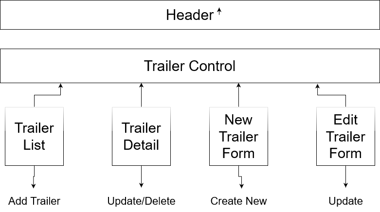

# _Trailer Shop Inventory Tracker_

#### By _**Alexander Kirkpatrick**_

#### _An application in React that tracks the inventory for a local business. Full CRUD capability._

## Technologies Used

* HTML
* CSS
* Javascript
* Markdown
* React
* JSX

## Setup/Installation Requirements

* _Clone repository from Github and save a copy on own computer_

* _Using GUI or terminal, open cloned project directory (titled 'trailer-shop') to view files_

* _Using GUI or terminal, open index.html file to view project locally_

* _Stylesheet, image, js file, and readme can also be opened from project home directory_

* _(See Github page for this project](https://alexanderkirkpatrick.github.io/Trailer-Shop-Inventory-Tracker/)_

## Component Diagram

## Known Bugs

* _When an item is updated, order, or altered in anyway, it will be pushed to the bottom of the list._

## License

MIT License

Copyright (c) _October_2022_ _Alexander Kirkpatrick_